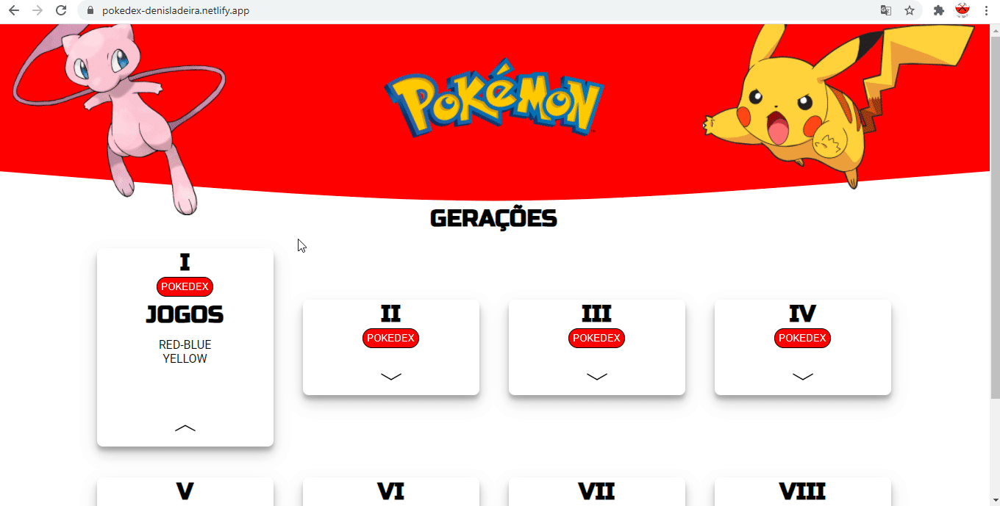

# PokedexGeneration

  

<h3 align="center">
  Challenge Delivery Much: Pokedex by generations using pokeapi.
</h3>

  <i>Desafio Delivery Much: Pokedex por Gerações usando a pokeapi.</i>

 
  
    <a href="https://pokedex-denisladeira.netlify.app/">Demo</a>
  

  

### About
Explanations about the challenge can be found in the link below in Portuguese.
https://drive.google.com/file/d/1ux480NApm5_kmitjczC4sgjTq3lZ7nFw/view?usp=sharing

<h4>Techs</h4>
<ul>
  <li> Typescript </li>
  <li> Angular
  <li> httpclient
  <li> rxjs
</ul>

### How to execute

1. Clone the project on your computer via Download (option Code -> Download ZIP)
    - If you want to do it with Git, make sure you have Git installed, follow the link https://git-scm.com/
2. Download Node if you have not configured it on your computer;
    - https://nodejs.org/en/
    - The npm package that we will use is usually installed together with Node.
3. In the terminal or prompt(cmd), access the project root;
4. At the root of the project, run `npm i` command to download the dependencies;
    - A node_modules folder will be created at the root of the project with the dependencies downloaded.
5. Run `npm start` to run the project;
6. The project will be available at http://localhost:4200, check your browser.

### Como executar (pt-br)

1. Clone o projeto em seu computador através do Download (opção 'Code' -> Download ZIP)
    - Caso queira fazer pelo Git, verifique se você tem o Git instalado, siga o link https://git-scm.com/
2. Baixe o Node caso você não tenha ele configurado em seu computador;
    - https://nodejs.org/en/
    - O pacote npm que iremos utilizar geralmente virá instalado juntamente com o Node.
3. No terminal ou prompt de comandos (cmd), acesse a raiz do projeto;
4. Na raiz do projeto, execute o comando `npm i` para baixar as dependências do projeto;
    - Uma pasta node_modules será criada na raiz do projeto com as dependências baixadas.
5. Execute `npm start` para executar o projeto;
6. O projeto estará disponível em http://localhost:4200, verifique o seu navegador.
